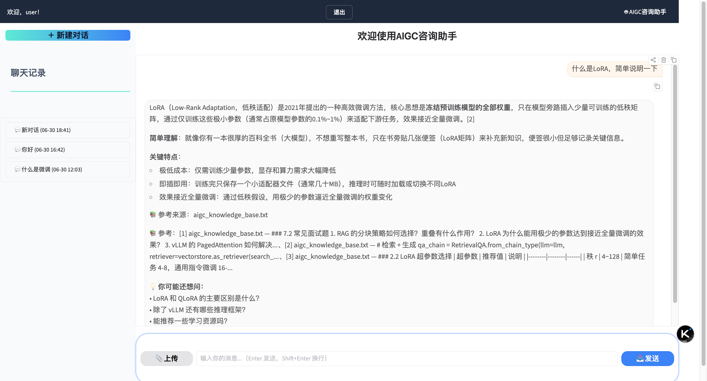
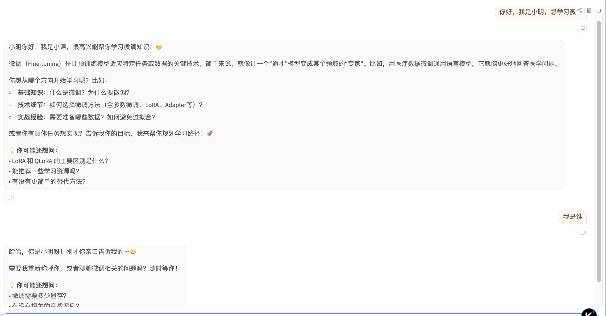

# AIGC 课程助手 — 项目完整报告（阶段一至四）

---

## 目录

- [一、项目概述](#一项目概述)
- [二、阶段一：原型搭建](#二阶段一原型搭建)
- [三、阶段二：稳定优化](#三阶段二稳定优化)
- [四、阶段三：核心模块攻坚](#四阶段三核心模块攻坚)
- [五、阶段四：智能对话增强](#五阶段四智能对话增强)
- [六、架构演进](#六架构演进)
- [七、测试体系](#七测试体系)
- [八、运行验证](#八运行验证)
- [九、各模块优化方向](#九各模块优化方向)
- [十、心得体会](#十心得体会)

---

## 一、项目概述

### 1.1 项目目标

构建一个面向 AIGC 大模型应用工程师的智能课程助手，具备以下核心能力：

- **知识问答**：基于课程资料的知识库检索增强生成（RAG）
- **联网搜索**：实时信息获取与总结
- **意图理解**：自动识别用户问题类型并路由到对应处理流程
- **多轮对话**：上下文记忆、复杂任务规划、后续问题推荐
- **用户系统**：注册登录、会话隔离、历史管理

### 1.2 技术栈

| 层次 | 技术选型 |
|------|---------|
| 后端框架 | FastAPI + SSE 流式 |
| 前端框架 | Gradio 6.x |
| 大语言模型 | DeepSeek（deepseek-v4-pro） |
| 嵌入模型 | instructor-xl（本地部署，MPS 加速） |
| 向量数据库 | ChromaDB（cosine 距离） |
| 稀疏检索 | BM25 + jieba 分词 |
| 搜索引擎 | 博查 AI Search（主）+ Bing 中国版（回退） |
| 认证 | bcrypt + JWT（HS256） |
| 数据库 | SQLite（会话持久化） |

### 1.3 项目规模

| 指标 | 数值 |
|------|------|
| 源代码文件 | 35+ |
| 代码行数 | ~5000+ |
| 测试用例 | 91 |
| 知识库文档数 | 60 片段 |
| 支持文件格式 | 8 种（PDF/DOCX/PPTX/HTML/IPYNB/TXT/MD/CSV） |
| API 端点 | 11 |

---

## 二、阶段一：原型搭建

> 版本：v0.4.0 | 提交：`c4c424a` | 前置条件：完成 A3 海聊机器人项目

### 2.1 目标

基于 Gradio 设计前端界面，搭建课程助手的 MVP（最小可用产品），验证核心链路：**RAG 知识问答 → 文件解析 → 意图识别 → 基础对话**。

### 2.2 产品定位

明确产品为「**课程问答助手 + 专业领域顾问**」，聚焦 AIGC 大模型应用工程师课程咨询场景。

### 2.3 实现内容

| 模块 | 实现 |
|------|------|
| Gradio 前端 | `course_assistant_ui.py`（466 行），SSE 流式对话 + 文件上传界面 |
| FastAPI 后端 | `course_assistant_api.py`（665 行），DeepSeek LLM + ChromaDB RAG |
| 知识库 | `aigc_knowledge_base.txt`，7 章 35 个片段 |
| 嵌入模型 | `instructor-xl` 本地部署，MPS/CUDA 加速 |
| 意图路由 | `EmbeddingIntentRouter`，一次嵌入同时完成意图路由和知识库检索 |
| 设计文档 | 技术方案确认 / 功能全景图（XMind）/ 系统架构图（SVG）/ 思维导图 |

### 2.4 完成标准核对

| 标准 | 状态 |
|------|:--:|
| 基于 Gradio 完成功能前端界面 | ✅ |
| 前端页面截图，符合示例参考 | ✅ |
| 展示界面交互效果（流式对话 + 文件上传） | ✅ |
| 明确产品为「课程问答助手 + 专业领域顾问」 | ✅ |
| 使用 XMind 绘制功能全景图 | ✅ |
| 识别 MVP 优先顺序：RAG问答 → 文件解析 → 意图识别 → 基础对话 | ✅ |
| 绘制系统架构图（前端、后端、数据库、AI 模块） | ✅ |
| 技术栈确认（FastAPI / ChromaDB / 嵌入模型 / 文件解析） | ✅ |

### 2.5 架构

```
用户 → Gradio UI → FastAPI → DeepSeek LLM
                         ↘ ChromaDB (instructor-xl embeddings)
```

单文件架构，所有逻辑在 `course_assistant_api.py` 中，约 665 行。

### 2.6 遇到的问题与解决

| 问题 | 解决方案 |
|------|---------|
| M1 Mac 上 CUDA 不可用 | instructor-xl 使用 MPS 加速，`EMBEDDING_DEVICE=mps` |
| ChromaDB 距离度量选择 | instructor-xl 嵌入相似度基线高（~0.9），阈值设为 0.69 |
| Gradio SSE 流式不稳定 | 使用 httpx 的 `iter_lines()` 解析 SSE 事件流 |

---

## 三、阶段二：项目规划与需求拆解

> 版本：v0.5.0 | 提交范围：`727f4b9` ~ `928cae9`

### 3.1 目标

完成产品定位、需求拆解、技术方案确认，为阶段三的核心模块攻坚奠定基础。

### 3.2 核心目标确认

| 任务 | 产出 |
|------|------|
| 产品定位 | 明确产品为「课程问答助手 + 专业领域顾问」 |
| 功能全景图 | XMind 脑图，梳理完整功能树 |
| MVP 优先级 | RAG 问答 → 文件解析 → 意图识别 → 基础对话 |
| 技术方案确认 | 系统架构图（前端、后端、数据库、AI 模块） |

### 3.3 技术栈确认

| 层次 | 选型 | 理由 |
|------|------|------|
| 后端框架 | FastAPI | 异步支持优于 Flask，SSE 流式原生支持 |
| 向量数据库 | ChromaDB | 轻量级，易本地部署，无需外部服务 |
| 嵌入模型 | instructor-xl | 本地部署，MPS/CUDA 加速，中文效果好 |
| 文件处理 | PyPDF2 / Unstructured | PDF 解析 + 8 种格式扩展 |
| LLM | DeepSeek | API 稳定，中文能力强，价格合理 |
| 前端 | Gradio | 快速搭建，Python 原生，适合原型验证 |

### 3.4 完成标准核对

| 标准 | 状态 |
|------|:--:|
| 产出思维导图，明确产品核心目标与 MVP 功能 | ✅ |
| 绘制完整系统架构图（前端、后端、数据库、AI 模块） | ✅ |
| 技术栈确认（FastAPI / ChromaDB / 嵌入模型 / 文件解析） | ✅ |
| Gradio 前端界面截图 | ✅ |
| 数据库表结构设计（会话表、用户表、知识库元数据表） | ✅ |

### 3.5 工程收尾

| 改进 | 说明 |
|------|------|
| 意图路由修复 | 修复路由标记错误，放宽闲聊回复限制 |
| 依赖管理 | `requirements.txt` 补全缺失依赖 |
| README 文档 | 项目说明 + 启动方式 + 核心特性 |
| 项目资产整理 | 清理临时文件、测试脚本 |

### 3.6 遇到的问题与解决

| 问题 | 解决方案 |
|------|---------|
| 依赖版本冲突 | passlib 与 bcrypt 4.x 不兼容 → 改用 bcrypt 直接调用 |
| 知识库内容泄漏 | system prompt 会重复引用知识库内容 → 限制引用格式 |

---

## 四、阶段三：核心模块攻坚

> 版本：v0.6.0 → v0.7.0 | 提交范围：`bff6e69` ~ `205bd91` | 技术文档：`第三阶段_核心模块攻坚_技术设计文档.md`

### 4.1 目标

按两周四周模块的节奏，完成架构重构 + 核心模块开发，从原型升级为可交付产品。

### 4.2 实现内容（对照课程要求）

| 课程模块 | 周次 | 计划 | 实际实现 | 超出预期 |
|---------|:--:|------|---------|:--:|
| 模块1：RAG 问答系统 | 第二周 | 混合检索（稠密+BM25+RRF） | HybridRetriever + BM25Index + RRF(k=60) | |
| 模块2：文件解析处理 | 第二周 | 8 格式 + 表格提取 | ParserRegistry + DocumentChunker | |
| 模块3：意图识别系统 | 第三周 | 5 类意图 + 回退链 | LLM 分类（主）+ k-NN 回退 + 快速规则拦截 | ✅ |
| 模块4：网络搜索模块 | 第三周 | DuckDuckGo | 博查 AI Search（主）+ Bing 中国版（回退）+ 流式 | ✅ |
| — 架构重构 | — | 单文件 → 模块化 | `src/` 35 文件包架构 | |
| — 用户认证 | — | 未在计划中 | bcrypt + JWT + 会话隔离 | ✅ 新增 |
| — 测试体系 | — | 未在计划中 | 42 个单元测试 | ✅ 新增 |

### 4.3 关键设计决策

| 决策 | 理由 |
|------|------|
| 博查而非 Bing 爬虫 | Bocha 是 DeepSeek 官方搜索供应商，中文质量高 |
| Bocha 回答直接用 | 防止 LLM 二次总结时编造（幻觉） |
| LLM 做意图分类 | LLM 理解语义 + 对话历史，准确率更高 |
| 并行化意图+搜索 | `asyncio.create_task` 不互相依赖，节省 2-3s |
| bcrypt 替代 passlib | passlib 和 bcrypt 4.x 不兼容 |
| JWT 认证 | 会话隔离，保护用户数据 |

### 4.4 搜索引擎选型历程

```
DuckDuckGo（被墙）→ Kimi API（不暴露搜索）→ 爬百度（反爬）→ 博查 ✅
```

### 4.5 意图分类架构

```
用户消息 → 快速规则(城市/赛事, 0延迟)
              │ 未命中
              ▼
          LLM分类(DeepSeek, 理解语义+对话历史)
              │ LLM失败
              ▼
          k-NN回退(嵌入+ChromaDB, 500条样本)
```

### 4.6 混合检索架构（RAG）

```
用户查询 → ├─ 稠密检索 (ChromaDB cosine)  → Top-10
           └─ 稀疏检索 (BM25 + jieba分词)  → Top-10
                    ↓
              RRF 融合 (k=60)              → Top-5
                    ↓
              RAGGenerator (流式 + 结构化引用[1][2])
```

### 4.7 遇到的问题与解决

| 问题 | 解决方案 |
|------|---------|
| RAG 类型不匹配 | RetrievalResult 类型统一 |
| ChromaDB None metadata | 过滤 None 值，使用 `or {}` 兜底 |
| web_ctx 死代码 | 清理未使用的网络搜索上下文注入路径 |
| 前端 UX 问题 | Enter 发送、消息即时显示、script 隐藏、输入框完善 |

---

## 五、阶段四：智能对话增强

> 版本：v0.8.0 | 报告：`第四阶段_智能对话增强_集成测试报告.md`
> 前置条件：阶段三验收通过
> 提示：模块1 参照 A2 阶段 chat_history 管理方法；模块2 对用户输入预处理，判断问题复杂度后拟定方案

### 5.1 目标

在保证已有功能稳定性的前提下（原 42 测试零回退），新增三个智能对话模块：

| 模块 | 课程要求 | 实际实现 |
|------|---------|---------|
| 模块1：对话历史管理与上下文记忆 | 用户连续问问题时，系统不能每次都像第一次见到用户一样 | ContextMemory：滑动窗口 + 事实提取 |
| 模块2：意图引导与多轮任务路由 | 判断用户想做什么 → 规划流程 → 执行；复杂问题拟定方案，简单问题直接处理 | ComplexityAnalyzer + TaskPlanner：规则+LLM混合 |
| 模块3：后续问题推荐系统 | 非必做，但实际完成了 | FollowUpRecommender：规则模板+LLM兜底 |

### 5.2 完成标准核对

| 标准 | 状态 |
|------|:--:|
| 保证已有系统功能稳定性前提下添加新功能（原 42 测试零回退） | ✅ |
| 模块1：对话历史管理，系统记住用户上下文 | ✅ |
| 模块2：意图引导，判断复杂度，复杂问题规划流程后执行 | ✅ |
| 模块3：后续问题推荐（非必做） | ✅ |
| 提交完整集成测试报告 | ✅ |

### 5.3 模块1：对话历史管理与上下文记忆

**解决问题**：用户连续问问题时，系统不能每次都像第一次见到用户一样。

**方案**：滑动窗口 + 轻量事实提取（混合方案）

```
原始历史 20 条
  → ContextMemory.build_context(history, recent_window=6)
    → 最近 6 条：原文保留
    → 更早 14 条：提取关键事实
        • 用户名提取
        • 技术主题识别（AIGC 关键词）
        • 未解决问题检测
    → 输出："【之前的对话记忆】用户叫小明。讨论过LoRA、vLLM…"
```

**效果验证**：

```
第 1 轮: "你好，我叫小明，我在学习大模型微调"
  → 回答: 你好，小明！你正在学习大模型微调…

第 2 轮: "你记得我叫什么吗？"
  → 回答: 当然记得！你叫小明，正在学习大模型微调。
```

### 5.4 模块2：意图引导与多轮任务路由

**解决问题**：用户说一句话后，系统要判断他想做什么，规划相应流程，然后进入执行。

**方案**：规则初筛 + LLM 深度规划（混合方案）

```
ComplexityAnalyzer.analyze(msg)
  ├─ 规则匹配（0 延迟）
  │   ├─ "你好"/"谢谢" → SIMPLE
  │   ├─ "先…再…"/"对比…和…" → COMPLEX
  │   ├─ 短消息 + 无技术术语 → SIMPLE
  │   └─ 长消息(>80字) → COMPLEX
  ├─ LLM 轻量判断（max_tokens=10）
  └─ 兜底 → SIMPLE（安全优先）

复杂问题 → TaskPlanner.plan()
  ├─ "LoRA和QLoRA有什么区别？" → 3步：检索→对比分析→给出建议
  ├─ "怎么部署vLLM？" → 2步：检索教程→整理步骤
  └─ "什么是RAG？" → 1步：检索知识库
```

### 5.5 模块3：后续问题推荐系统

**解决问题**：回答结束后推荐 2-3 个相关问题，帮助用户发现下一步追问方向。

**方案**：规则模板 + LLM 兜底（混合方案）

```
FollowUpRecommender.recommend()
  ├─ 技术关键词 → 话题模板
  │   LoRA → "LoRA和QLoRA的主要区别是什么？"
  │   RAG → "如何提升RAG的检索准确率？"
  ├─ 内容类型 → 专用模板
  │   对比类 → "在实际项目中应该怎么选择？"
  │   教程类 → "有没有更简单的替代方法？"
  └─ LLM 兜底（非技术内容）
  → SSE done 事件附带 2-3 个推荐
  → 前端渲染 "💡 你可能还想问："
```

**效果验证**：

```
查询: "什么是 RAG？"
  → 推荐: "如何提升 RAG 的检索准确率？"
         "大模型选型有什么建议？"
         "有没有更简单的替代方法？"
```

### 5.6 完整请求链路

```
用户消息
  │
  ├─ 1. ContextMemory — 滑动窗口 + 事实提取
  ├─ 2. IntentRouter — 5 类意图分类
  ├─ 3. ComplexityAnalyzer — 简单/复杂判断
  ├─ 4. [复杂] TaskPlanner — 生成执行计划
  ├─ 5. RAG/搜索/闲聊 — 生成回答
  └─ 6. FollowUpRecommender — 推荐后续问题
```

### 5.7 新增文件

| 文件 | 行数 | 说明 |
|------|------|------|
| `src/session/context_memory.py` | 170 | ContextMemory 上下文记忆管理器 |
| `src/intent/complexity.py` | 250 | ComplexityAnalyzer + TaskPlanner |
| `src/intent/followup.py` | 220 | FollowUpRecommender |
| `tests/test_rag.py` | 210 | RAG 检索/提示词/集成测试 |

### 5.8 遇到的问题与解决

| 问题 | 解决方案 |
|------|---------|
| `_extract_memory()` 漏写 `return` | 函数返回 None → `_format_memory` 崩溃，补上 return |
| history 变量名冲突 | streaming 端点中全量 history 和 recent_history 混淆，逐引用排查 |
| ChatResponse 缺 followup 字段 | Pydantic 模型新增 `followup: list = []` |
| 前端不处理 followup | SSE done 事件中添加解析和渲染 |
| 非技术内容推荐为空 | 预期行为，加 LLM 兜底 (`recommend_async`) |
| 旧进程未杀导致改动不生效 | 重启前确认端口释放 |

---

## 六、架构演进

### 6.1 代码组织

```
阶段一二：单文件架构
course_assistant_api.py (665行)
course_assistant_ui.py   (466行)

        ↓ 阶段三：模块化重构

src/
├── main.py              # FastAPI 入口 + 端点
├── config.py            # 集中配置
├── embedding.py         # instructor-xl
├── auth/                # JWT 认证
├── intent/              # 意图分类 + 路由
├── rag/                 # 混合检索 + 生成
├── parser/              # 8 格式文件解析
├── search/              # 网络搜索
└── session/             # 会话管理

        ↓ 阶段四：智能增强

src/
├── session/
│   ├── manager.py       # 增强：build_messages 支持 memory_summary
│   └── context_memory.py # [新] ContextMemory
├── intent/
│   ├── classifier.py
│   ├── router.py
│   ├── complexity.py     # [新] ComplexityAnalyzer + TaskPlanner
│   ├── followup.py       # [新] FollowUpRecommender
│   └── prompts.py
└── rag/
    ├── retriever.py
    ├── generator.py      # 增强：支持 memory_summary + followup
    └── prompts.py        # 增强：支持 memory_summary
```

### 6.2 测试增长

```
阶段一：0 测试
阶段二：0 测试
阶段三：42 测试
阶段四：74 测试（+ RAG 集成 = 91）
```

### 6.3 各阶段版本

| 阶段 | 版本 | 关键能力 |
|:--:|------|------|
| 一 | v0.4.0 | 基本 RAG + SSE 流式 + 知识库 |
| 二 | v0.5.0 | 稳定性修复 + 工程基础 |
| 三 | v0.6.0 ~ v0.7.0 | 模块化 + 混合检索 + 意图分类 + 搜索 + 认证 |
| 四 | v0.8.0 | 上下文记忆 + 复杂度分析 + 任务规划 + 问题推荐 |

---

## 七、测试体系

### 7.1 测试总览

| 测试文件 | 用例数 | 覆盖模块 | 类型 |
|---------|--------|---------|------|
| `test_auth.py` | 8 | 注册/登录/JWT | 单元 + 集成 |
| `test_intent.py` | 26 | 意图分类 + 复杂度 + 规划 + 推荐 | 单元 |
| `test_search.py` | 8 | 搜索引擎 + 缓存 + 限流 | 单元 |
| `test_session.py` | 17 | 会话管理 + 上下文记忆 | 单元 + 集成 |
| `test_rag.py` | 17 | BM25 + 提示词 + 混合检索 | 单元 + 集成 |
| **合计** | **74** | | |

> 含 RAG 集成测试（需 ChromaDB + instructor-xl）= **91 测试全过**

### 7.2 关键回归用例

| 用例 | 保护目标 |
|------|---------|
| `test_retrieve_rag_returns_results` | 调 `RAG_TOP_K` 后检索不退化 |
| `test_retrieve_agent_returns_results` | 调 `RRF_K` 后检索不退化 |
| `test_short_history_all_recent` | 短对话不触发压缩 |
| `test_long_history_splits` | 长对话正确分割 |
| `test_complex_multi_step` | 多步骤指令识别 |
| `test_simple_greeting` | 问候不误判为复杂 |
| `test_recommend_no_duplicates` | 推荐问题不重复 |
| `test_build_messages_with_memory_summary` | memory_summary 正确注入 |

### 7.3 测试执行

```bash
# 快速测试（不含 RAG 集成，16s 完成）
$ python -m pytest tests/ --ignore=tests/test_rag.py -v
============================= 74 passed in 16.80s ==============================

# RAG 集成测试（需加载 embedding 模型，21s 完成）
$ python -m pytest tests/test_rag.py -v
============================= 17 passed in 21.05s ==============================

# 全量测试
$ python -m pytest tests/ -v
============================= 91 passed in 37s =================================
```

---

## 八、运行验证

### 8.1 启动方式

```bash
cd /Users/dinghao/Desktop/pbl
source pbl_venv/bin/activate

# 后端（端口 8001）
python src/main.py

# 前端（另开终端）
python course_assistant_ui.py
```

### 8.2 功能验证

**RAG 知识问答**：

```
查询: "vLLM 的 PagedAttention 是什么？"
  → Source: rag
  → Docs: 5 条参考来源
  → 回答: PagedAttention 是 vLLM 的核心创新，借鉴操作系统虚拟内存的分页机制…
  → 推荐: ["除了 vLLM 还有哪些推理框架？", "Transformer 的核心原理是什么？"]
```

**上下文记忆**：

```
第 1 轮: "你好，我叫小明，我在学习大模型微调"
  → 回答确认身份和主题

第 2 轮: "你记得我叫什么吗？"
  → 回答: 当然记得！你叫小明，正在学习大模型微调。
  → 推荐: ["LoRA 和 QLoRA 的主要区别是什么？", "开源模型和闭源模型怎么选？"]
```

**复杂度判断**：

```
"你好" → SIMPLE（规则，0ms）
"先查 RAG，再对比 LangChain 和 LlamaIndex" → COMPLEX（规则，0ms）
"LoRA 参数设置有什么讲究？" → SIMPLE（fallback 兜底）
```

---

## 九、各模块优化方向

### 9.1 RAG 检索

| 优化方向 | 优先级 | 预期收益 |
|---------|:--:|------|
| 重排序（Reranker） | 高 | 检索精度提升 5-10% |
| 查询扩展增强 | 中 | 召回率提升 |
| 多路召回（关键词+语义+实体） | 中 | 覆盖面更广 |
| 分块策略自适应 | 低 | 不同类型文档不同分块 |

### 9.2 意图识别

| 优化方向 | 优先级 | 预期收益 |
|---------|:--:|------|
| 多标签分类（一个消息多个意图） | 中 | "帮我找 LoRA 资料并总结"识别更准 |
| 意图置信度感知路由 | 中 | 低置信度时主动确认 |
| 增量学习（用户反馈纠正分类） | 低 | 长尾意图覆盖 |

### 9.3 上下文记忆

| 优化方向 | 优先级 | 预期收益 |
|---------|:--:|------|
| 重要消息标记持久化 | 中 | "记住这个"跨会话保持 |
| 通用实体识别（NER） | 低 | 非 AIGC 话题也能提取关键信息 |
| 对话摘要（LLM 压缩） | 低 | 超长对话的语义压缩 |

### 9.4 任务路由

| 优化方向 | 优先级 | 预期收益 |
|---------|:--:|------|
| 计划状态持久化 | 高 | 支持"继续下一步""重做步骤2" |
| 计划与检索策略联动 | 中 | 不同步骤自动选择最优检索参数 |
| 断点续传 | 低 | 会话恢复时恢复计划状态 |

### 9.5 问题推荐

| 优化方向 | 优先级 | 预期收益 |
|---------|:--:|------|
| 前端可点击按钮 | 高 | 点击直接填入并发送 |
| 用户点击行为记录 | 中 | 排序优化 |
| 多样化推荐（避免同类） | 中 | 覆盖面更广 |
| 话题模板扩展 | 低 | 支持更多领域 |

### 9.6 工程基础设施

| 优化方向 | 优先级 | 预期收益 |
|---------|:--:|------|
| CI/CD 流水线 | 高 | 自动化测试 + 部署 |
| 日志聚合 + 监控 | 中 | 问题定位更快 |
| API 文档自动生成 | 中 | FastAPI 自带 `/docs`，可增强 |
| Docker 容器化 | 低 | 环境一致性 |

---

## 十、心得体会

### 10.1 架构演进的价值

从阶段一的 665 行单文件到阶段三的 35 文件模块化架构，再到阶段四的新模块接入——好的架构让新增功能像搭积木。阶段三的模块化重构是本项目最重要的投资，它为阶段四的三个模块提供了清晰的扩展点。

### 10.2 混合方案是务实之选

四个阶段中反复验证的一个模式：

```
规则处理常见场景（快、稳、省钱）+ LLM 兜底边缘场景（准、活）
```

从阶段三的意图分类（快速规则 + LLM + k-NN），到阶段四的三个模块（全部采用混合方案），这个模式在整个项目中证明了其有效性。

### 10.3 测试先行的回报

阶段一二没有测试，调参靠盲调。阶段三补了 42 个测试，阶段四新增 32 个测试——现在改 `TOP_K`、调 `RRF_K`、改窗口大小，跑一下测试就知道有没有退化。测试是对未来自己的善意。

### 10.4 搜索选型的教训

阶段三的搜索引擎选型经历了四次失败才找到正确答案（DuckDuckGo → Kimi → 百度 → 博查）。这提醒我：外部依赖的选取应该尽早验证，不要假设"看起来能用就真的能用"。

### 10.5 前后端耦合的隐性成本

模块3 的推荐问题在后端已生成，但前端要单独改才能展示。微服务化后，新功能需要两端同步更新——要么统一协议（OpenAPI Schema 自动生成前端类型），要么接受双倍工作量。

### 10.6 知识库是 RAG 的灵魂

60 篇文档的知识库让 RAG 回答有据可依、带引用标注。知识库质量和覆盖面直接决定 RAG 的上限——混合检索、RRF 融合都是锦上添花，知识库才是根本。

### 10.7 回头看

本项目从零起步，经过四个阶段的迭代，从一个 665 行的原型成长为 35+ 文件、91 测试、11 个 API 端点的完整产品。最深的体会是：


## 功能截图

###  RAG 知识问答



### 上下文记忆




